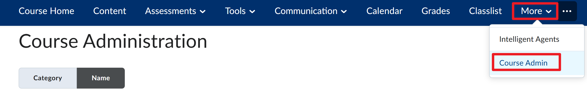
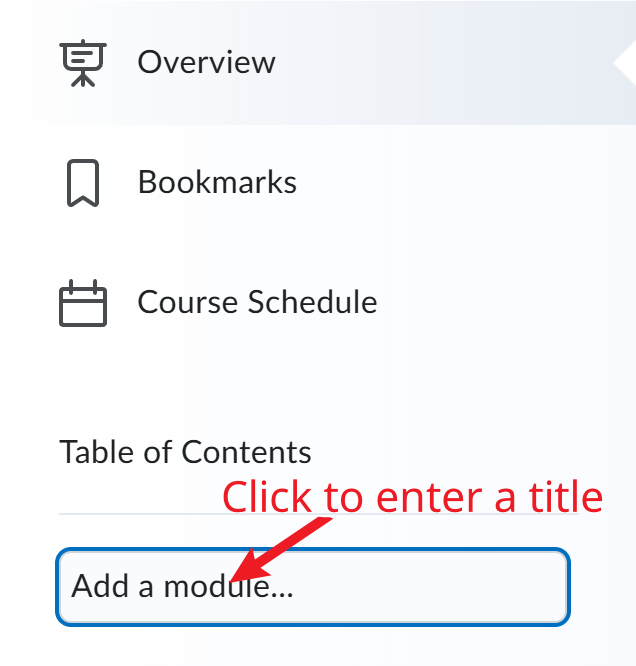

# Basics about Brightspace

## How to activiate the course

- Go to Course admin (see image below)
  
  {width=60%}

- Click on "Course Offering Information"
  
  {width=60%}

- Scroll down to "Active" and click on the checkbox
  
  {width=60%}

- Click on "Save" at the bottom of the page
  
  {width=60%}

## How to add a new module

- Go to "Content" in the top navbar
  
  {width=60%}

- On the left side panel, click on "Add Module" to enter the module name and click the "Return" key on your keyboard
  
  {width=60%}

## How to add a new topic

- On the left side panel, click on the module name you want to add the topic to, then click "Upload/Create" and select "Create a File"
  
  {width=60%}

## How to create a Webwork assignment

- Go to the module or file/page that you want to add the Webwork assignment to

- Click on "Existing Activities"
  
  {width=60%}

- Select "External Learning Tools"
  
  {width=60%}

- In the popup window, scroll down to the bottom of the page and click "Create New LTI Link"
  
  {width=60%}

- Fill in the title and URL of the Webwork assignment, then click "Create and Insert"
  
  {width=60%}

## How to create a Myopenmath assignment

- Go to the module or file/page that you want to add the Webwork assignment to

- Click on "Existing Activities"
  
  {width=60%}

- Select "MyOpenMath Assessment"
  
  {width=60%}

- In the dropdown menu, select the course if it is the first assignment that you are creating, then select an assignment you want to add
  
  {width=60%}

## How to add multiple Myopenmath assignments

- Go to MyOpenMath course page and click "Export" on the left side panel
  
  {width=60%}

- In the dropdown menu next to "Items to export", select "Select Individual Item to Export"
  
  {width=60%}

- Check the the assignments you want to export

- Next to Your LMS, select "D2L Brightspace"
  
  {width=60%}

- Click "Download Export Cartridge" to download the package
  
  {width=60%}

- Go to Brightspace, in top navbar, click "More" and then click "Course admin"
  
  {width=60%}

- Click "Import / Export / Copy Components"
  
  {width=60%}

- Choose "Import Components" and click "Start"
  
  {width=60%}

- Click "Upload" to upload the cartridge you downloaded from Myopenmath and click "Import all components" after the upload is complete
  
  {width=60%}

  You should find new modules containing assignments you exported from Myopenmath on the left side panel of modules.

- After homework assignments are created in Brightspace, for the first time, you need to click on the assignment to link the assignment with your Myopenmath account, which is similar to what you did when you created the first assignment in BB.

- One thing to note is that you need to manually add the homework to Brightspace gradebook. For that, click on the assignment, on the bottom of the page, click "Add assessment".
  
  {width=60%}

- In the dropdown menu above the "Add assessment" button, select the assessment name and click "Save"
  
  {width=60%}

- By default, link created by importing the cartridge is not open to a new window. To change this, click arrow down icon next to the assignment, then click "Edit properties in place" and check the box "Open as External Resource".
  
  {width=60%}